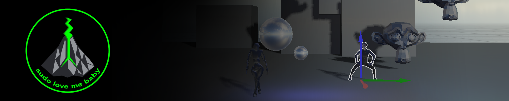

<div align="center">

</div>


[](#-features)
[](https://github.com/svatostop/anthrax-ai?tab=MIT-1-ov-file)
[](https://www.youtube.com/@sudolovemebaby)

## ✨ table of contents
- [about anthrax-ai project](#-about-anthrax-ai-project)
- [features](#-features)
- [usage](#-usage)
- [how to build](#-how-to-build)
- [known issues](#-known-issues)
- [license](https://github.com/svatostop/anthrax-ai?tab=MIT-1-ov-file)

## 💥 about anthrax-ai project

Vulkan-Based Game Engine written in C++, project is in active development, may not compile :)  

I present my work real time on youtube
[](https://www.youtube.com/@sudolovemebaby)

⛅ <em>This is an education project and I am improving/fixing my stuff as fast as I have capacity and time for this. I keep it open source since I like the idea of sharing the code. 
But since it is first of all my education project I would like to fix and improve stuff by my own :')
I really appreciate your input but I can't promise that I will merge your PR since it is breaking my whole idea why this project is alive </em>

## 🎮 usage

⚠️ WARNING! [issues remain](#known-issues)

1. Press `Esc` to visualize Editor window.
2. In Editor Window select provided scenes from "Scenes" dropdown or create a default scene by pressing "New Scene" button.
3. Use `Esc` to toggle between `editor` and `play` modes
4. When in `play` mode use WASD to mode camera, for rotation use LMB
5. You can select a 3D object and move it using arrows 
6. Use `Debug` tab for debug information
7. Use `Audio` tab to play available audios
8. Use `Update Shader` to update shader code in real time
9. Use `Rendering` tab to visualize render targets, change light position, shadows, cubemaps
10. Use `Scene` to navigate trough scene objects, change their textues; use `Add Object` to create new object
more info in [features](#-features)


## 💫 features
- [vulkan features](#vulkan-features)
- [mouse picking and gizmo](#mouse-picking-and-gizmo)
- [debug render target visualization](#debug-render-target-visualization)
- [outlines](#outlines)
- [real time shader compilation](#real-time-shader-compilation)
- [cubemaps](#cubemaps)
- [shadows](#shadows)
- [adding or removing objects](#adding-or-removing-objects)
- [saving scene state](#saving-scene-state)

### vulkan features

<p align="center">

</p>

- Implemented multithreaded command buffer submission
- Bindless textures and buffers
- Dynamic rendering
- Cool wrappers

---

### mouse picking and gizmo

<p align="center">

</p>

Custom implementation for object mouse picking using SSBO.
Translation of objects using gizmo `x, y, z` axes

---

### debug render target visualization

<p align="center">

</p>

Visualize your render targets in order to help debugging and analyzing in real time

---

### outlines

<p align="center">

</p>

Outlines are rendered for selected object using object's mask

---

### real time shader compilation

<p align="center">

</p>

You can recompile shaders in real time

---

### cubemaps

<p align="center">

</p>

You can change cubemaps in real time
    - you can enable/disable cubemaps in `Rendering` tab in Editor window
    - you can select cubemap from available cubemaps in `Rendering` tab in Editor window

---

### shadows

<p align="center">

</p>

Simple shadow mapping Implemented
    - you can enable/disable shadows in `Rendering` tab in Editor window

---

### adding or removing objects

<p align="center">

</p>

You can add different types of objects (3D models, sprites, lights) using Editor Widnow
    - navigate to `Scene` tab
    - press `Add Object` and select type 
    - in new window add object ID, select texture, model (if available, depends on the type), position
    - press `Save`
    - delete any object by selecting it and pressing `Delete` key on the keyboard

---

### saving scene state

<p align="center">

</p>

You can save current scene state by pressing `Save Scene` button in Editor Window 
    - objects presented on the scene will be saved (their position, texture)
    - cubemap state will be saved
    - shadows state will be saved
You can also create a new default scene by pressing `New Scene` button in Editor Window 

---

## ⚒️ how to build

### dependencies

To build this project, you need to have the following dependencies installed:

- [Vulkan SDK](https://vulkan.lunarg.com/sdk/home);
- X11/XCB libraries *(linux only)*;

If you're on linux, you can install them using the scripts under the `tools/linux` directory:

#### install Vulkan SDK

```bash
./tools/linux/install-vulkan-sdk.sh
```

#### install X11/XCB libraries

```bash
./tools/linux/install-x11-xcb.sh
```

If you're on windows, you can install the Vulkan SDK from the link above.

### configure

This project uses CMake to generate the build files. To configure the project, you can use
the following commands:

```bash
cmake -B build -S .
```

During the configuration process, the shaders will be compiled using the `glslc` compiler.
If you don't want to compile them, you could pass the `-DAAI_COMPILE_SHADERS=OFF` flag to the
`cmake` command above.

### build

After configuring the project, you can build it using the following command:

```bash
cmake --build build
```

### build using Visual Studio Code

As you could notice, this project has the Visual Studio Code workspace file. If you want to build
and debug the project using Visual Studio Code, you can open the workspace file and install
the recommended extensions:
    - on Windows open: engine-win.code-workspace
    - on Linux open: engine-lin.code-workspace

    - make sure you have GCC compiler installed https://code.visualstudio.com/docs/languages/cpp#_example-install-mingwx64-on-windows
    - make sure you have CMake Tools extension installed


With the CMakeTools extension installed, you could select the compiler, and then build or run the
project using the <kbd>F7</kbd> and <kbd>F5</kbd> keys, respectively.

Don't forget that the <kbd>CTRL+SHIFT+P</kbd> key combination helps to `configure` and `build` as well.

### tracy profiler

    - uncomment `#define TRACY` from engine/code/include/anthraxAI/utils/tracy.h and recompile the project
    - install [Tracy Profiler](https://github.com/wolfpld/tracy) locally, run the profiler
    - connect anthraxAI engine in the profiler.
- Audio functionality will be disabled due to code errors


## 📌 Known Issues
- usually doesn't work under Windows
- Pascal and older nvidia cards are unsupported due to unavailable vulkan features on that hardware.
- Modified CatchyOS packages break compilation of required `assimp` library
- Audio initialization sometimes fails with `failed to allocate buffers` error 
